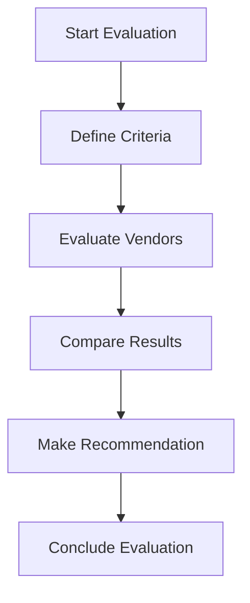

# DSPM Vendor Evaluation Report - Capital Group

## Executive Summary

This report presents the findings of the DSPM (Data Security Posture Management) vendor evaluation conducted for Capital Group. The evaluation focused on identifying a suitable vendor to enhance the organization's data security posture and strengthen its ability to detect, respond, and prevent threats.

 

Key criteria considered during the evaluation included:

1. Integration
2. Resource Discovery in CSP
3. Scalability
4. Data Governance
5. Data Security & Posture Management
6. Visibility & Monitoring
7. Threat Detection & Response
8. Automation & Orchestration
9. Cost of Evaluation

 

The report provides an in-depth analysis of four prominent DSPM vendors: Varonis, Cyera, Bedrock, and Theom. It includes an assessment of their key features, strengths, weaknesses, and overall evaluation summary. Ultimately, the report provides a recommendation based on Capital Group's specific requirements and identifies a preferred vendor to address the organization's data security objectives.

## Introduction
This section outlines the DSPM vendor evaluation process, detailing the methodology, scope, and goals. It highlights the primary factors that influenced vendor selection and the criteria employed to evaluate their capabilities.

### Integration Criteria
This section consists the summary of checklist for each vendor to integrates with our existing cloud environments and respective stacks. Considerations include:

1. Deployment/integration documentation
2. Deployment patterns
3. Support for following stack
    * AWS
    * Azure
    * Snowflake
    * Databricks
    * Office 365
    * Custom Integration
        * SQL Server on EC2
4. Integration with SIEM/SOAR solutions

## Vendor Evaluation Outcome (Ahead's POV)
| # | Criteria | Varonis | Cyera | Bedrock | Theom |
|---|---|---|---|---|---|
| 1 | **Integration** | ⭐️⭐️ | ⭐️⭐️⭐️ | ⭐️⭐️⭐️⭐️⭐️ | ⭐️⭐️⭐️⭐️ |
| 2 | **Resource Discovery in CSP** | ⭐️⭐️ | ⭐️⭐️⭐️ | ⭐️⭐️⭐️⭐️ | ⭐️⭐️⭐️⭐️⭐️ |
| 3 | **Scalability** | ⭐️ | ⭐️⭐️⭐️ | ⭐️⭐️⭐️⭐️ | ⭐️⭐️⭐️⭐️ |
| 4 | **Data Governance** | ⭐️⭐️ | ⭐️⭐️⭐️⭐️ | ⭐️⭐️⭐️ | ⭐️⭐️⭐️ |
| 5 | **Data Security & Posture  Management** | ⭐️ | ⭐️⭐️⭐️ | ⭐️⭐️⭐️⭐️ | ⭐️⭐️⭐️⭐️⭐️ |
| 6 | **Visibility & Monitoring** | ⭐️ | ⭐️⭐️⭐️ | ⭐️⭐️⭐️⭐️ | ⭐️⭐️⭐️⭐️ |
| 7 | **Threat Detection & Response** | ⭐️ | ⭐️ | ⭐️⭐️⭐️⭐️ | ⭐️⭐️⭐️⭐️⭐️ |
| 8 | **Automation & Orchestration** | ⭐️ | ⭐️⭐️ | ⭐️⭐️⭐️ | ⭐️⭐️⭐️⭐️ |
| 9 | **Cost of Evaluation** | ⭐️ | ⭐️⭐️ | ⭐️⭐️⭐️⭐️⭐️ | ⭐️⭐️⭐️⭐️ |
| 10 | **Average** | 1.33 | 2.67 | 3.89 | 4.11 |
| 11 | **Ahead Recommendation** | ❌ | ❕ | ✅ | ✅✅ |

***

 

## <b>Vendor Profiles</b>
## Varonis
### Rating: 1.33

#### Overview
* Wrong server (EKS clusters) sizing for deployment due to which the data discovery was not complete.
* Data classification is based on columns (RD) or keys (in JSON) or headers (CSV)
* Requested data dictionary for custom headers or keys for mapping to data sources, which shouldn't be case for DSPM vendor.
* Very expensive yet completing only 14% of the data discovery out of 240 TB data.
* No support for databricks.
* Lack of details in the product documentation.
* Good integration with Office 365. 

#### Key Features
| Varonis Feature | Availability | Description |
|-------------------|---|-------------|
| Data Discovery    | ✓ | Automatically identifies and catalogs sensitive data across various data sources |
| Data Classification | ❌ | Categorizes data based on Varonis data dictionary and not based on sampling. Custom headers or Key names were requested by Varonis team for mapping |
| Risk Assessment   | ✓ | Evaluates data security risks and provides actionable insights |
| Access Control    | ❕ | Data access permissions monitoring was not robust and not reliable |
| Compliance Monitoring | ✓ | Ensures adherence to regulatory requirements and industry standards |
| Threat Detection  | ❌ | Potential security threats and anomalies detection rate is not accurate and less reliable |
| Data Encryption   | ❕ | Varonis team did not provide insights on how sampling data is transmitted to Varonis cloud for classification |
| Activity Monitoring | ✓ | Tracks and logs user activities related to sensitive data |
| Incident Response | ❕ | Provides tools and workflows for responding to security incidents.   Note: Varonis team did not demonstrate this feature. |
| Integration Capabilities | ✓ | Connects with existing security tools and cloud platforms |
| Reporting and Analytics | ❕ | Generates high level reports and provides data visualization |
| Automated Remediation | ❌ | Does not or atleast this feature was not demonstrated, which offers automated solutions for addressing identified security issues.   Note: Scan was incomplete. |

#### <u>Strengths & Weaknesses</u>

**Strengths:**

* **Office 365 Integration:** Demonstrated good integration capabilities with Office 365, which is important for Capital Group.
* **Data Discovery (partial):**  Able to perform data discovery, although it was not complete due to deployment issues.
* **Risk Assessment & Compliance Monitoring:**  Provides risk assessment and compliance monitoring features that are useful for identifying and managing security risks.
* **Activity Monitoring:** Offers robust activity monitoring which helps in detecting potential threats.

**Weaknesses:**

* **Incomplete Data Discovery:** Deployment challenges affected the scope of data discovery, limiting the effectiveness of overall solution.
* **Costly:** High cost for limited data discovery.
* **Complex Deployment:** Deployment process was complicated and lengthy.
* **High Infrastructure Requirements:**  Requires extensive EKS and AKS cluster for scanning 250 TB of data which is not sustainable.
* **Lack of Scalability:**  Not suitable for large scale data discovery. 
* **No Support for Databricks:** Lacks support for databricks which is a crucial data platform for capital group.
* **Custom data dictionary:** Varonis uses Custom Headers or Keys and data dictionary for classifying data which was not suitable for capital group and not ideal way to classify data.
* **Threat detection**: Not accurate and unreliable.

#### [Review Required] Integration Checklist

| Resource | Integration Status | Notes |
|----------|------------|-------|
| AWS      | Yes | - S3 Buckets   - RDS for Oracle, Postgres, SQL Server  |
| Azure    | Limited | - Azure AD integration   - Azure Blob storage access   - ADLS Gen 2   - Azure Database for Oracle, Postgres, SQL Server   - Audit Logs were not enabled or integrated |
| Snowflake| Yes | - Set up Snowflake account integration - Configure access to relevant databases and schemas - Verify query history and access logging |
| Databricks| No |  |
| Office 365| Yes | - Set up Microsoft Graph API integration - Configure access to relevant services (SharePoint, OneDrive, etc.) - Enable audit logging for Office 365 activities |

 

**Data Discovery Coverage:**

| Data Source | Discovery Coverage |
|---|---|
| AWS | 10% |
| Azure | 20% |
| Snowflake | 100% |
| Databricks | 0% |
| Office 365 | 100% |
| SQL Server on EC2 | 0% |
| **Total** | **38%** |

 

**[WIP] Cost Analysis:**

| Element | Cost (USD) |
|---|---|
| Day 1 - Tuesday| $ |
| Day 2 - Wednesday | $ |
| Day 3 - Thursday | $ |
| Day 4 - Friday | $ |
| Day 5 - Saturday | $ |
| Day 6 - Sunday | $ |
| Day 7 - Monday | $ |
| **Total** | **$** |
|||

#### Evaluation Summary

Varonis showed limited capabilities in meeting the requirements of Capital Group's data security posture management (DSPM) needs. Challenges included incomplete data discovery due to infrastructure issues, reliance on custom data dictionaries for classification instead of a robust sampling mechanism, and a lack of demonstrated threat detection capabilities. Furthermore, the solution was found to be very expensive for the scope of data discovery achieved, making it a non-viable option in comparison to other vendors. The overall integration process also proved complex, with minimal or few missing details available in product documentation. Varonis is recommended for exploration when data privacy and governance is important within Office 365 environment.

***
***
### Cyera

### Rating: 2.67

#### Overview
* Deployment was complete with all the required data sources except Databricks.
* Data classification is limited but quite accurate. Few columns were left without classification like last 8 digits of SSN.
* Requested data dictionary for custom headers or keys for mapping to data sources, which shouldn't be case for DSPM vendor.
* Very expensive! Ahead request to force stop the discovery of remaining data after two days as cost burn down was quite high for the first 50 TB data.
* No support for databricks.
* No posture management with current version. Will be available in next releases of Cyera platform.
* Good integration with Office 365. 

#### Key Features
| Varonis Feature | Availability | Description |
|-------------------|---|-------------|
| Data Discovery    | ✓ | Automatically identifies and catalogs sensitive data across various data sources |
| Data Classification | ✓ | Data classification is based on sampling hence the classified data were quite accurate. Few obfuscated columns were left out like last 4 digits of SSN |
| Risk Assessment   | ❕ | Evaluates data security risks and provides limited actionable insights and no data coverage tracability |
| Access Control    | ❕ | Data access permissions monitoring was not robust and not reliable |
| Compliance Monitoring | ✓ | Ensures adherence to regulatory requirements and industry standards |
| Threat Detection  | ❌ | Potential security threats and anomalies detection rate is not accurate and less reliable |
| Data Encryption   | ❕ | Cyera team did not provide insights on how sampling data is transmitted to Cyera cloud for classification |
| Activity Monitoring | ✓ | Tracks and logs user activities related to sensitive data |
| Incident Response | ❌ | Cyera team did not demonstrate this feature and mentioned that this feature is available in future releases of their product |
| Integration Capabilities | ✓ | Connects with existing security tools and cloud platforms |
| Reporting and Analytics | ✓ | Generates high level reports and provides data visualization along with data samples for verification |
| Automated Remediation | ❌ | Does not or atleast this feature was not demonstrated, which offers automated solutions for addressing identified security issues.   Note: Scan was incomplete due to force stop as cost burn down was high for the first 50 TB data. |

#### <u>Strengths & Weaknesses</u>
#### <u>Strengths & Weaknesses</u>

**Strengths:**
1. Accurate data classification based on sampling
2. Complete deployment with most required data sources
3. Good integration with Office 365
4. Effective compliance monitoring
5. Strong activity monitoring capabilities
6. Good reporting and analytics with data visualization

**Weaknesses:**
1. Very expensive, with high cost burn down for initial data discovery
2. No support for Databricks
3. Lack of posture management in the current version
4. Limited risk assessment with no data coverage traceability
5. Unreliable access control and permissions monitoring
6. Inaccurate and unreliable threat detection
7. Lack of transparency in data encryption for classification process
8. Absence of incident response features in the current version
9. No automated remediation capabilities demonstrated but integration is possible with Wiz, Jira and Webhooks.
10. Incomplete data discovery due to forced stop (cost concerns)

#### [Review Required] Integration Checklist

| Resource | Integration Status | Notes |
|----------|------------|-------|
| AWS      | Yes | - S3 Buckets   - RDS for Oracle, Postgres, SQL Server  |
| Azure    | Yes | - Azure AD integration   - Azure Blob storage access   - ADLS Gen 2   - Azure Database for Oracle, Postgres, SQL Server   - Audit Logs were not enabled or integrated |
| Snowflake| Yes | - Set up Snowflake account integration - Configure access to relevant databases and schemas - Verify query history and access logging |
| Databricks| No |  |
| Office 365| Yes | - Set up Microsoft Graph API integration - Configure access to relevant services (SharePoint, OneDrive, etc.) - Enable audit logging for Office 365 activities |

 

**Data Discovery Coverage:**

| Data Source | Discovery Coverage |
|---|---|
| AWS | 30% |
| Azure | 50% |
| Snowflake | 100% |
| Databricks | 0% |
| Office 365 | 100% |
| SQL Server on EC2 | 0% |
| **Total** | **56%** |

 

**[WIP] Cost Analysis:**

| Element | Cost (USD) |
|---|---|
| Day 1 - Tuesday| $ |
| Day 2 - Wednesday | $ |
| Day 3 - Thursday | $ |
| Day 4 - Friday | $ |
| Day 5 - Saturday | $ |
| Day 6 - Sunday | $ |
| Day 7 - Monday | $ |
| **Total** | **$** |
|||

#### Evaluation Summary
Cyera demonstrates strong capabilities in data discovery and classification across multiple cloud platforms, including AWS, Azure, Snowflake, and Office 365. However, the evaluation reveals several significant limitations:

1. Incomplete data discovery (56% total coverage) due to cost concerns and forced stoppage.
2. Lack of posture management features in the current version.
3. Limited risk assessment capabilities without data coverage traceability.
4. Unreliable access control and permissions monitoring.
5. Inaccurate and unreliable threat detection.
6. Lack of transparency in data encryption for the classification process.
7. Absence of incident response features.
8. No automated remediation capabilities, although integration is possible with third-party tools.

While Cyera shows promise in its integration capabilities with major cloud providers and services, the platform falls short in critical areas of data security posture management. The incomplete data discovery and lack of essential features like posture management, reliable risk assessment, and incident response significantly impact its overall effectiveness. 

CG should carefully consider these limitations before adopting Cyera as their DSPM solution. Further development and improvements in these areas would be necessary for Cyera to provide a more comprehensive and reliable DSPM offering.

Test Mermaid Block in GitHub

## Comparison Matrix

## Recommendation

## Conclusion

## Appendix

### Glossary
1. SIEM - Security Information and Event Management
2. SOAR - Security Orchestration, Automation and Response
3. 

