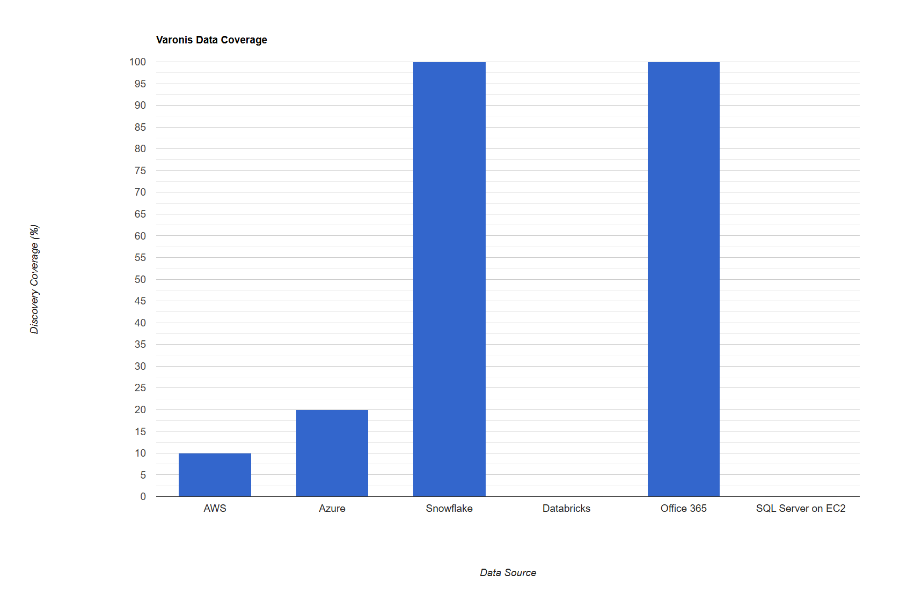

# DSPM Vendor Evaluation Report - Capital Group

## Executive Summary

This report presents the findings of the DSPM (Data Security Posture Management) vendor evaluation conducted for Capital Group. The evaluation focused on identifying a suitable vendor to enhance the organization's data security posture and strengthen its ability to detect, respond, and prevent threats.

 

Key criteria considered during the evaluation included:

1. Integration
2. Resource Discovery in CSP
3. Scalability
4. Data Governance
5. Data Security & Posture Management
6. Visibility & Monitoring
7. Threat Detection & Response
8. Automation & Orchestration
9. Cost of Evaluation

 

The report provides an in-depth analysis of four prominent DSPM vendors: Varonis, Cyera, Bedrock, and Theom. It includes an assessment of their key features, strengths, weaknesses, and overall evaluation summary. Ultimately, the report provides a recommendation based on Capital Group's specific requirements and identifies a preferred vendor to address the organization's data security objectives.

## Introduction
This section outlines the DSPM vendor evaluation process, detailing the methodology, scope, and goals. It highlights the primary factors that influenced vendor selection and the criteria employed to evaluate their capabilities.

### Integration Criteria
This section consists the summary of checklist for each vendor to integrates with our existing cloud environments and respective stacks. Considerations include:

1. Deployment/integration documentation
2. Deployment patterns
3. Support for following stack
    * AWS
    * Azure
    * Snowflake
    * Databricks
    * Office 365
    * Custom Integration
        * SQL Server on EC2
4. Integration with SIEM/SOAR solutions

## Vendor Evaluation Outcome (Ahead's POV)
| # | Criteria | Varonis | Cyera | Bedrock | Theom |
|---|---|---|---|---|---|
| 1 | **Integration** | ⭐️⭐️ | ⭐️⭐️⭐️ | ⭐️⭐️⭐️⭐️⭐️ | ⭐️⭐️⭐️⭐️ |
| 2 | **Resource Discovery in CSP** | ⭐️⭐️ | ⭐️⭐️⭐️ | ⭐️⭐️⭐️⭐️ | ⭐️⭐️⭐️⭐️⭐️ |
| 3 | **Scalability** | ⭐️ | ⭐️⭐️⭐️ | ⭐️⭐️⭐️⭐️ | ⭐️⭐️⭐️⭐️ |
| 4 | **Data Governance** | ⭐️⭐️ | ⭐️⭐️ | ⭐️⭐️⭐️ | ⭐️⭐️⭐️ |
| 5 | **Data Security & Posture  Management** | ⭐️ | ⭐️⭐️⭐️ | ⭐️⭐️⭐️⭐️ | ⭐️⭐️⭐️⭐️⭐️ |
| 6 | **Visibility & Monitoring** | ⭐️ | ⭐️⭐️⭐️ | ⭐️⭐️⭐️⭐️ | ⭐️⭐️⭐️⭐️ |
| 7 | **Threat Detection & Response** | ⭐️ | ⭐️ | ⭐️⭐️⭐️⭐️ | ⭐️⭐️⭐️⭐️⭐️ |
| 8 | **Automation & Orchestration** | ⭐️ | ⭐️⭐️ | ⭐️⭐️⭐️ | ⭐️⭐️⭐️⭐️ |
| 9 | **Cost of Evaluation** | ⭐️ | ⭐️⭐️ | ⭐️⭐️⭐️⭐️⭐️ | ⭐️⭐️⭐️⭐️ |
| 10 | **Average** | 1.33 | 2.33 | 3.89 | 4.22 |
| 11 | **Ahead Recommendation** | ❌ | ❕ | ✅ | ✅✅ |

***

## <b>Vendor Profiles</b>
## Varonis
### Rating: 1.33

[Detailed Varonis Report](vendor-profiles/1-varonis.md)

#### Overview
* Wrong server (EKS clusters) sizing for deployment due to which the data discovery was not complete.
* Very expensive yet completing only 14% of the data discovery out of 240 TB data.
* No support for databricks.
* Lack of details in the product documentation.
* Good integration with Office 365. 
* Data classification is based on columns (RD) or keys (in JSON) or headers (CSV)
* Requested data dictionary for custom headers or keys for mapping to data sources, which shouldn't be case for DSPM vendor.

#### Integration Checklist

| Resource | Integration Status | Notes |
|----------|------------|-------|
| AWS      | Yes | - S3 Buckets   - RDS for Oracle, Postgres, SQL Server  |
| Azure    | Limited | - Azure AD integration   - Azure Blob storage access   - ADLS Gen 2   - Azure Database for Oracle, Postgres, SQL Server   - Audit Logs were not enabled or integrated |
| Snowflake| Yes | - Set up Snowflake account integration - Configure access to relevant databases and schemas - Verify query history and access logging |
| Databricks| No |  |
| Office 365| Yes | - Set up Microsoft Graph API integration - Configure access to relevant services (SharePoint, OneDrive, etc.) - Enable audit logging for Office 365 activities |

 

**Varonis Data Coverage:**

Referece URL for HTML chart: <a href="varonis-data-coverage-chart.html" target="_blank">Varonis Data Coverage Chart</a>

**Varonis Cost Anaylsis:**

Referece URL for HTML chart: <a href="https://dccpl.work/cgah-dspm-ve/vendor-a/vendor-a-cost-burndown-chart.html" target="_blank">Varonis Cost Burn Down Charts</a>

#### Evaluation Summary

Varonis showed limited capabilities in meeting the requirements of Capital Group's data security posture management (DSPM) needs. Challenges included incomplete data discovery due to infrastructure issues, reliance on custom data dictionaries for classification instead of a robust sampling mechanism, and a lack of demonstrated threat detection capabilities. Furthermore, the solution was found to be very expensive for the scope of data discovery achieved, making it a non-viable option in comparison to other vendors. The overall integration process also proved complex, with minimal or few missing details available in product documentation. Varonis is recommended for exploration when data privacy and governance is important within Office 365 environment.

***
***