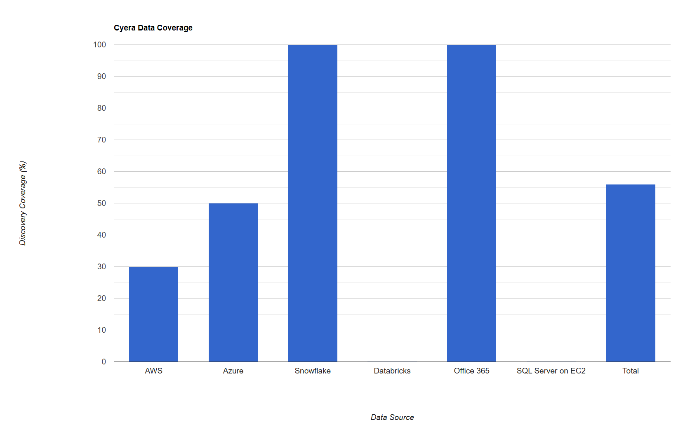
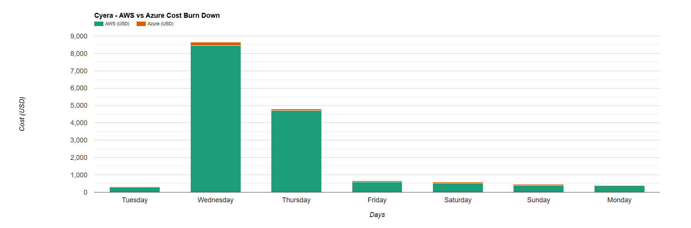

# DSPM Vendor Evaluation Report - Capital Group

## Executive Summary

This report presents the findings of the DSPM (Data Security Posture Management) vendor evaluation conducted for Capital Group. The evaluation focused on identifying a suitable vendor to enhance the organization's data security posture and strengthen its ability to detect, respond, and prevent threats.

 

Key criteria considered during the evaluation included:

1. Integration
2. Resource Discovery in CSP
3. Scalability
4. Data Governance
5. Data Security & Posture Management
6. Visibility & Monitoring
7. Threat Detection & Response
8. Automation & Orchestration
9. Cost of Evaluation

 

The report provides an in-depth analysis of four prominent DSPM vendors: Varonis, Cyera, Bedrock, and Theom. It includes an assessment of their key features, strengths, weaknesses, and overall evaluation summary. Ultimately, the report provides a recommendation based on Capital Group's specific requirements and identifies a preferred vendor to address the organization's data security objectives.

## Introduction
This section outlines the DSPM vendor evaluation process, detailing the methodology, scope, and goals. It highlights the primary factors that influenced vendor selection and the criteria employed to evaluate their capabilities.

### Integration Criteria
This section consists the summary of checklist for each vendor to integrates with our existing cloud environments and respective stacks. Considerations include:

1. Deployment/integration documentation
2. Deployment patterns
3. Support for following stack
    * AWS
    * Azure
    * Snowflake
    * Databricks
    * Office 365
    * Custom Integration
        * SQL Server on EC2
4. Integration with SIEM/SOAR solutions

## Vendor Evaluation Outcome (Ahead's POV)
| # | Criteria | Varonis | Cyera | Bedrock | Theom |
|---|---|---|---|---|---|
| 1 | **Integration** | ⭐️⭐️ | ⭐️⭐️⭐️ | ⭐️⭐️⭐️⭐️⭐️ | ⭐️⭐️⭐️⭐️ |
| 2 | **Resource Discovery in CSP** | ⭐️⭐️ | ⭐️⭐️⭐️ | ⭐️⭐️⭐️⭐️ | ⭐️⭐️⭐️⭐️⭐️ |
| 3 | **Scalability** | ⭐️ | ⭐️⭐️⭐️ | ⭐️⭐️⭐️⭐️ | ⭐️⭐️⭐️⭐️ |
| 4 | **Data Governance** | ⭐️⭐️ | ⭐️⭐️ | ⭐️⭐️⭐️ | ⭐️⭐️⭐️ |
| 5 | **Data Security & Posture  Management** | ⭐️ | ⭐️⭐️⭐️ | ⭐️⭐️⭐️⭐️ | ⭐️⭐️⭐️⭐️⭐️ |
| 6 | **Visibility & Monitoring** | ⭐️ | ⭐️⭐️⭐️ | ⭐️⭐️⭐️⭐️ | ⭐️⭐️⭐️⭐️ |
| 7 | **Threat Detection & Response** | ⭐️ | ⭐️ | ⭐️⭐️⭐️⭐️ | ⭐️⭐️⭐️⭐️⭐️ |
| 8 | **Automation & Orchestration** | ⭐️ | ⭐️⭐️ | ⭐️⭐️⭐️ | ⭐️⭐️⭐️⭐️ |
| 9 | **Cost of Evaluation** | ⭐️ | ⭐️⭐️ | ⭐️⭐️⭐️⭐️⭐️ | ⭐️⭐️⭐️⭐️ |
| 10 | **Average** | 1.33 | 2.33 | 3.89 | 4.22 |
| 11 | **Ahead Recommendation** | ❌ | ❕ | ✅ | ✅✅ |

***

## <b>Vendor Profiles</b>
## Varonis
### Rating: 1.33

[Detailed Varonis Report](vendor-profiles/1-varonis.md)

#### Overview
* Very expensive yet completing only 14% of the data discovery out of 240 TB data.
* Varonis do not provide support for databricks yet.
* Lack of details in the product documentation. (Refer meeting recording on day one for postgres integration in Azure)
* Good integration with Office 365.
* Robust Compliance and Activity monitoring features.
* Wrong server (EKS clusters) sizing for deployment due to which the data discovery was not complete.  
* $\textcolor{orange}{\text{Data classification is based on columns (RD) or keys (in JSON) or headers (CSV).}}$
* $\textcolor{orange}{\text{Requested data dictionary for custom headers or keys for mapping to data sources, which shouldn't be case for DSPM vendor.}}$

#### Integration Checklist

| Resource | Integration Status | Notes |
|----------|------------        |-------|
| AWS      | Yes                | - S3 Buckets   - RDS for Oracle, Postgres, SQL Server  |
| Azure    | Limited            | - Azure AD integration   - Azure Blob storage   - ADLS Gen 2   - Azure Database for Oracle, Postgres, SQL Server   - $\textcolor{orange}{\text{Audit Logs were not enabled for integration}}$ |
| Snowflake| Yes                | - Snowflake account integration   - Configure access to relevant databases and schemas   - Verify query history and access logging |
| Databricks| No                |  |
| Office 365| Yes               | - Microsoft Graph API integration   - Configure access to relevant services (SharePoint, OneDrive, etc.)|

 

**Varonis Data Coverage:**

Referece URL for HTML chart: <a href="varonis-data-coverage-chart.html" target="_blank">Varonis Data Coverage Chart</a>

**Varonis Cost Anaylsis:**

Referece URL for HTML chart: <a href="https://dccpl.work/cgah-dspm-ve/vendor-a/vendor-a-cost-burndown-chart.html" target="_blank">Varonis Cost Burn Down Charts</a>

#### Evaluation Summary

Varonis demonstrated limited capabilities in meeting Capital Group's data security posture management (DSPM) requirements. Challenges included incomplete and potentially inaccurate data discovery due to platform limitations and configuration complexities, reliance on custom data dictionaries for classification instead of robust data sampling, and insufficient threat detection capabilities.  Furthermore, the solution's high cost relative to the limited data discovery achieved positioned it as a less competitive option compared to other vendors. The integration process was also complex, with gaps in product documentation. While Varonis might be suitable for organizations prioritizing data privacy and governance within Office 365 environments, it did not adequately address Capital Group's broader DSPM needs. 

***
***
***

## Cyera
### Rating: 2.33

[Detailed Cyera Report](vendor-profiles/2-cyera.md)

#### Overview
* Deployment was complete with all the required data sources except Databricks.
* Data classification is very limited but accurate for classifed data. Many columns were left without classification like city name, driver license, date, last 8 digits of SSN and many more columns.
* Very expensive! Ahead request to force stop the discovery of remaining data after two days as cost burn down was quite high for the first 50 TB data.
* Good integration with Office 365.
* No support for databricks.
* $\textcolor{red}{\text{Uses most privilage mode (Administrator account is created when Cyera stack was deployed into Azure).}}$
* $\textcolor{red}{{\text{Data is transmitted to Cyera's cloud for sampling and analysis, indicating that Cyera retains the data within their environment.}}}$
* $\textcolor{red}{\text{No posture management with current version. Will be available in next releases of Cyera platform.}}$
* $\textcolor{red}{\text{No audit trails in current version. One of the use case of role assumption was not demonstrated as the feature was not available in current version of Cyera.}}$
* $\textcolor{red}{\text{Cyera Team did not agreed to perform delta scan as they mentioned that, "We need to take permission from their higher authorities for doing this in POC"}}$
* $\textcolor{orange}{\text{Control over cluster scaling in and out is not possible as it's managed by DevOps team of Cyera (Backoffice channels). Uses Karpernter or similar technologies for K8s scaling.}}$
* $\textcolor{orange}{\text{Cyera deployment uses spot instances for data discovery. This is not recommended for production deployment.}}$
* $\textcolor{orange}{\text{Business executives were overpowering the technical team and reviewers to perform limited tests in POC. (Proof: Please review all the meeting recordings for verification and conclusion on this observation.)}}$

 

#### Integration Checklist

| Resource | Integration Status | Notes |
|----------|------------|-------|
| AWS      | Yes | - S3 Buckets   - RDS for Oracle, Postgres, SQL Server  |
| Azure    | Yes | - Azure AD integration   - Azure Blob storage access   - ADLS Gen 2   - Azure Database for Oracle, Postgres, SQL Server   - Audit Logs were not enabled or integrated |
| Snowflake| Yes | - Set up Snowflake account integration - Configure access to relevant databases and schemas - Verify query history and access logging |
| Databricks| No |  |
| Office 365| Yes | - Set up Microsoft Graph API integration - Configure access to relevant services (SharePoint, OneDrive, etc.) - Enable audit logging for Office 365 activities |
||||

 

#### Cyera Data Coverage

HTML Chart URL: [Cyera Data Discovery](https://dccpl.work/cgah-dspm-ve/vendor-b/vendor-b-data-coverage-chart.html)

#### Cyera Cost Analysis: 

 

HTML Chart URL: [Cyera Cost Burn Down and Peak Cost charts](https://dccpl.work/cgah-dspm-ve/vendor-b/vendor-b-cost-burndown-chart.html)

#### Evaluation Summary
Cyera demonstrates okayish capabilities in data discovery and classification across multiple cloud platforms, including AWS, Azure, Snowflake, and Office 365. However, the evaluation reveals several significant limitations:

1. Incomplete data discovery (56% total coverage) due to cost concerns and forced stoppage.
2. Lack of posture management features in the current version.
3. Limited risk assessment capabilities without data coverage traceability.
4. Unreliable access control and permissions monitoring.
5. Inaccurate and unreliable threat detection.
6. Lack of transparency in data encryption for the classification process.
7. Absence of incident response features.
8. No automated remediation capabilities, although integration is possible with third-party tools.

While Cyera shows promise in its integration capabilities with major cloud providers and services, the platform falls short in critical areas of data security posture management. The incomplete data discovery and lack of essential features like posture management, reliable risk assessment, and incident response significantly impact its overall effectiveness. 

Further development and improvements in these areas would be necessary for Cyera to provide a more comprehensive and reliable DSPM offering.

***
***
***

