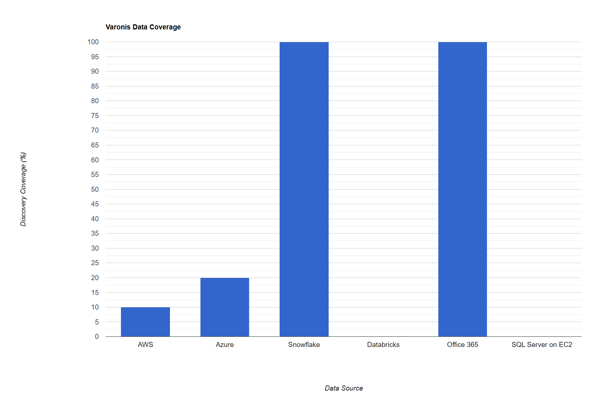
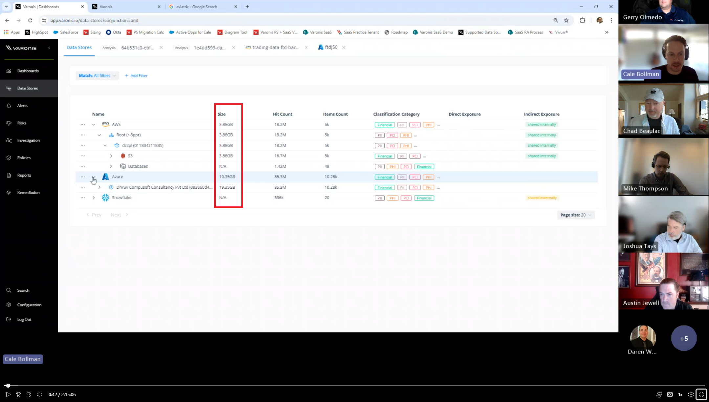
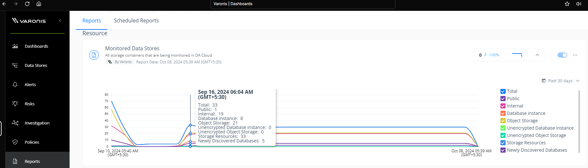
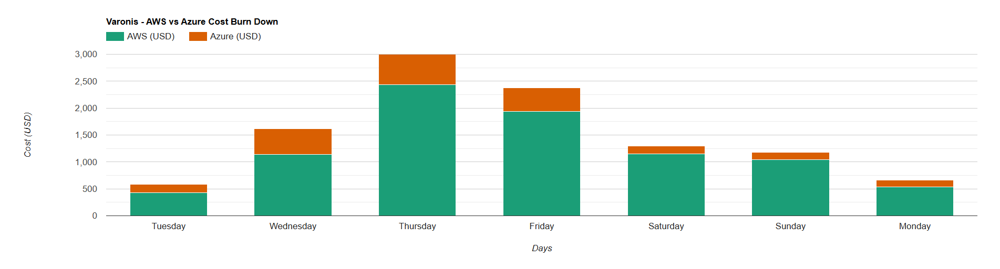
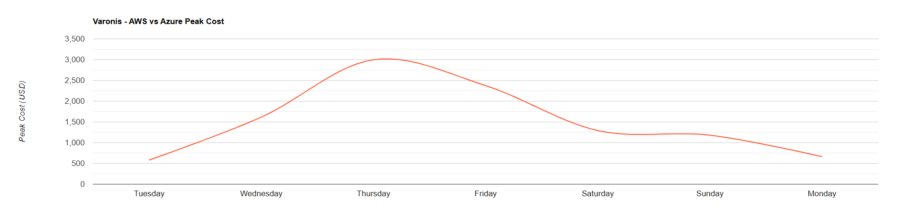
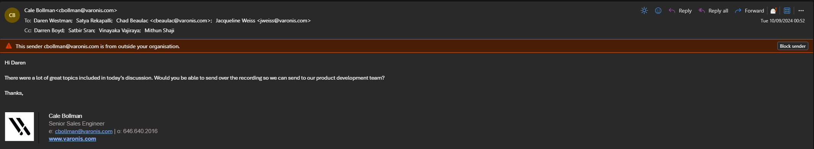

## Varonis
### Rating: 1.33

#### Overview
* Very expensive yet completing only 14% of the data discovery out of 240 TB data.
* Varonis do not provide support for databricks yet.
* Lack of details in the product documentation. (Refer meeting recording on day one for postgres integration in Azure)
* Good integration with Office 365.
* Robust Compliance and Activity monitoring features.
* Wrong server (EKS clusters) sizing for deployment due to which the data discovery was not complete.  
* $\textcolor{orange}{\text{Data classification is based on columns (RD) or keys (in JSON) or headers (CSV).}}$
* $\textcolor{orange}{\text{Requested data dictionary for custom headers or keys for mapping to data sources, which shouldn't be case for DSPM vendor.}}$

#### Key Features
| Varonis Feature | Availability    | Description | $\textcolor{Red}{\text{Notes [For Ahead Only]}}$ |
|---                        |---    |---|---|
| Data Discovery            | ❕    | Limited identification and classification of data from various resources.  | -  Varonis team did not discover all the buckets and data sources. Please refer to [Screenshot from Varonis Data Store Dashboard on Review Day:](#screenshot-from-varonis-data-store-dashboard-on-review-day).    - Varonis attemted twice reasoning the strict policy rules setup yet failed to discover the data.    - Varonis calims that 180 TB of data was scanned in their final report yet their dashboard are showing very limited coverage. Please follow the screenshots and charts below.|
| Data Classification       | ❌    | Categorizes data based on Varonis data dictionary and not based on sampling. Custom headers or Key names were requested by Varonis team for mapping | - Varonis team requested for data catalog or mapping document for obfuscated column name or key names.    - The absence of Databricks integration restricts the Varonis platform's classification ranking when compared with other vendors. |
| Risk Assessment           | ✓    | Evaluates data security risks and provides actionable insights | - Varonis report has the relevant screenshots and same information was shared on review day.|
| Access Control            | ❕    | Data access permissions monitoring was not robust and not reliable for Azure data stores. | - Varonis team demonstrated this feature only for AWS, Snkowflake and not for Azure data stores:  databases, blob storage amd ADLS Gen 2.    -On review day, Varonis primarily focused on AWS resources and Snowflake only. |
| Compliance Monitoring     | ✓    | Ensures adherence to regulatory requirements and industry standards | - Varonis team provided good insights on the review day about the capabilities of their platform on compliance monitoring features. |
| Threat Detection          | ❌    | Potential security threats and anomalies detection rate is not accurate and less reliable | - Considering the partial data discovery and the lack of classifications for obfuscated values, Varonis platform cannot be deemed as a viable platform.  |
| Data Encryption           | ❕    | Varonis team did not provide insights on how sampling data is transmitted to Varonis cloud for classification | |
| Activity Monitoring       | ✓    | Tracks and logs user activities related to sensitive data | - Varonis team showcased good insights on service accounts and user activity monitoring features.    - Varonis conducts scans at scheduled intervals; therefore, it does not monitor activity in real-time. This is common across all DSPM vendors. |
| Incident Response         | ❕    | Provides tools and workflows for responding to security incidents. | - Varonis team did not demonstrate incident response capabilities in detail except role assumptions.    - Varonis platform failed to detect the data movements like copying or deleting the records out of AWS or Azure to online Excel or reading data from Snowflake and creating the PII JSONs in S3 bucket and deleting records in RDS instances.|
| Integration Capabilities  | ❕    | Connects with existing security tools and cloud platforms | - No integration with Databricks yet.    - Varonis team mentioned that, "Databricks integration will be available in next quarter but cannot commit on dates as they are public traded company!" |
| Reporting and Analytics   | ❕    | Generates high level reports and provides data visualization | |
| Automated Remediation     | ❌    | Does not or atleast this feature was not demonstrated, which offers automated solutions for addressing identified security issues.   Note: Scan was incomplete. | |
||||

#### <u>Strengths & Weaknesses</u>

**Strengths:**

* **Office 365 Integration:** Demonstrated good integration capabilities with Office 365, which is important for Capital Group.
* **Data Discovery (partial):**  Able to perform data discovery, although it was not complete due to strict policy rules of configuration issues.
* **Risk Assessment & Compliance Monitoring:**  Provides risk assessment and compliance monitoring features that are useful for identifying and managing security risks.
* **Activity Monitoring:** Offers robust activity monitoring which helps in detecting potential threats.

**Weaknesses:**

* **Incomplete Data Discovery:** Deployment challenges affected the scope of data discovery, limiting the effectiveness of overall solution.
* **Costly:** High cost for limited data discovery.
* **Complex Deployment:** Deployment process was complicated and lengthy.
* **High Infrastructure Requirements:**  Requires huge EKS and AKS cluster for scanning 250 TB of data, which is not sustainable for Petabyte+ scale environments.
* **Lack of Scalability:**  Not suitable for large scale data discovery due to slow scan rate. 
* **No Support for Databricks:** Lacks support for databricks which is a crucial data platform for capital group.
* **Custom data dictionary:** Varonis uses Custom Headers or Keys and data dictionary for classifying data which was not suitable for capital group and not ideal way to classify data.
* **Threat detection**: Not accurate and unreliable.
* APIs calls for AWS were not optimised! AWS support team raised concerns for overusage of CloudTrail and over-bursting on netowrk (EKS cluster).

***

#### Integration Checklist

| Resource | Integration Status | Notes |
|----------|------------|-------|
| AWS      | Yes | - S3 Buckets   - RDS for Oracle, Postgres, SQL Server  |
| Azure    | Limited | - Azure AD integration   - Azure Blob storage   - ADLS Gen 2   - Azure Database for Oracle, Postgres, SQL Server   - $\textcolor{orange}{\text{Audit Logs were not enabled for integration}}$ |
| Snowflake| Yes | - Snowflake account integration   - Configure access to relevant databases and schemas   - Verify query history and access logging |
| Databricks| No |  |
| Office 365| Yes | - Microsoft Graph API integration   - Configure access to relevant services (SharePoint, OneDrive, etc.)|
 

**Data Discovery Coverage:**
#### Table View:
| Data Source | Coverage |
|---|---|
| AWS | 10% |
| Azure | 20% |
| Snowflake | 100% |
| Databricks | 0% |
| Office 365 | 100% |
| SQL Server on EC2 | 0% |
| **Total** | **38%** |
|||

#### Chart View

HTML Chart URL: <a href="https://dccpl.work/cgah-dspm-ve/vendor-a/vendor-a-data-coverage-chart.html" target="_blank">Varonis Data Discovery Chart</a>

#### Screenshot from Varonis Data Store Dashboard on Review Day:

***

#### Varonis Data Coverage

Screenshot of Monitored Data Stores from Varonis platform

$\textcolor{Red}{\text{Important Observations [For Ahead Only]}}$:
- While Varonis reported scanning 80% of the data environment, the dashboard displayed significantly lower data volumes, raising concerns about the accuracy of the reported coverage. Please refer to the Varonis review meeting recordings for dashboard details.
- Varonis attributed the initial incomplete data discovery to overly restrictive policy rules. Despite adjustments to these rules for a second scan, the discovery rate remained significantly lower than expected. Refer to the screenshot above.
- Access to the Varonis application has been unavailable since October 11, 2024.
***
 

**Cost Analysis:**

| Day | Cost (USD) |
|---|---|
| Day 1 - Tuesday, 3-Sept-2024      | $ 426.40        | $ 156.65          |
| Day 2 - Wednesday, 4-Sept-2024    | $ 1,136.53      | $ 479.16          |
| Day 3 - Thursday,  5-Sept-2024    | $ 2,435.86      | $ 562.51          |
| Day 4 - Friday, 6-Sept-2024       | $ 1,943.15      | $ 432.22          |
| Day 5 - Saturday, 7-Sept-2024     | $ 1,147.90      | $ 145.34          |
| Day 6 - Sunday, 8-Sept-2024       | $ 1,040.54      | $ 140.23          |
| Day 7 - Monday, 9-Sept-2024       | $ 534.88        | $ 128.81          |
| **Total**                         | **$ 8,665.26**  | **$ 2,044.92**    |
|||

**Varonis Cost Anaylsis:**

Referece URL for HTML chart: <a href="https://dccpl.work/cgah-dspm-ve/vendor-a/vendor-a-cost-burndown-chart.html" target="_blank">Varonis Cost Burn Down Charts</a>

***

#### Evaluation Summary

Varonis demonstrated limited capabilities in meeting Capital Group's data security posture management (DSPM) requirements. Challenges included incomplete and potentially inaccurate data discovery due to platform limitations and configuration complexities, reliance on custom data dictionaries for classification instead of robust data sampling, and insufficient threat detection capabilities.  Furthermore, the solution's high cost relative to the limited data discovery achieved positioned it as a less competitive option compared to other vendors. The integration process was also complex, with gaps in product documentation. While Varonis might be suitable for organizations prioritizing data privacy and governance within Office 365 environments, it did not adequately address Capital Group's broader DSPM needs. 

***
#### References
1. Review meeting URL: https://thinkaheadit-my.sharepoint.com/:v:/r/personal/daren_westman_ahead_com/Documents/Recordings/Varonis%20-%20DSPM%20Daily%20Office-Hours%20(Ahead%20Vendor%20Evaluation)-20240909_080249-Meeting%20Recording.mp4?csf=1&web=1&e=AyxL9n&nav=eyJyZWZlcnJhbEluZm8iOnsicmVmZXJyYWxBcHAiOiJTdHJlYW1XZWJBcHAiLCJyZWZlcnJhbFZpZXciOiJTaGFyZURpYWxvZy1MaW5rIiwicmVmZXJyYWxBcHBQbGF0Zm9ybSI6IldlYiIsInJlZmVycmFsTW9kZSI6InZpZXcifX0%3D

2. Excel file containing Varonis response on FR and NFRs: [Download Excel File](../assets/varonis/Varonis_Final_Report.20240924.xlsx)

3. Final Report by Varonis: [Download PDF File](../assets/varonis/Varonis_Final_Report_Overview.20240913.pdf)

4. Varonis team requested meeting recording for their product development team stating in an email, "There were a lot of great topics included in today’s discussion. Would you be able to send over the recording so we can send to our product development team?" 
***