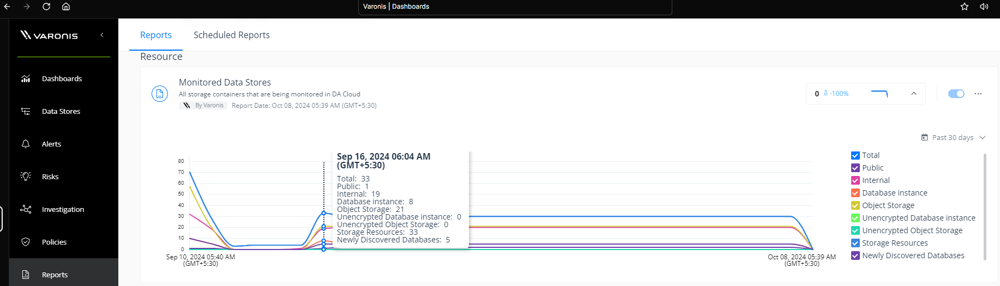

## Varonis
### Rating: 1.33

#### Overview
* Very expensive yet completing only 14% of the data discovery out of 240 TB data.
* Varonis do not provide support for databricks yet.
* Lack of details in the product documentation.
* Good integration with Office 365.
* Wrong server (EKS clusters) sizing for deployment due to which the data discovery was not complete.  
* $\textcolor{orange}{\text{Data classification is based on columns (RD) or keys (in JSON) or headers (CSV).}}$
* $\textcolor{orange}{\text{Requested data dictionary for custom headers or keys for mapping to data sources, which shouldn't be case for DSPM vendor.}}$

#### Key Features
| Varonis Feature | Availability | Description |
|-------------------|---|-------------|
| Data Discovery    | ❕ | Limited identification and classification of data from various resources.  |
| Data Classification | ❌ | Categorizes data based on Varonis data dictionary and not based on sampling. Custom headers or Key names were requested by Varonis team for mapping |
| Risk Assessment   | ✓ | Evaluates data security risks and provides actionable insights |
| Access Control    | ❕ | Data access permissions monitoring was not robust and not reliable |
| Compliance Monitoring | ✓ | Ensures adherence to regulatory requirements and industry standards |
| Threat Detection  | ❌ | Potential security threats and anomalies detection rate is not accurate and less reliable |
| Data Encryption   | ❕ | Varonis team did not provide insights on how sampling data is transmitted to Varonis cloud for classification |
| Activity Monitoring | ✓ | Tracks and logs user activities related to sensitive data |
| Incident Response | ❕ | Provides tools and workflows for responding to security incidents.   Note: Varonis team did not demonstrate this feature. |
| Integration Capabilities | ✓ | Connects with existing security tools and cloud platforms |
| Reporting and Analytics | ❕ | Generates high level reports and provides data visualization |
| Automated Remediation | ❌ | Does not or atleast this feature was not demonstrated, which offers automated solutions for addressing identified security issues.   Note: Scan was incomplete. |

#### <u>Strengths & Weaknesses</u>

**Strengths:**

* **Office 365 Integration:** Demonstrated good integration capabilities with Office 365, which is important for Capital Group.
* **Data Discovery (partial):**  Able to perform data discovery, although it was not complete due to deployment issues.
* **Risk Assessment & Compliance Monitoring:**  Provides risk assessment and compliance monitoring features that are useful for identifying and managing security risks.
* **Activity Monitoring:** Offers robust activity monitoring which helps in detecting potential threats.

**Weaknesses:**

* **Incomplete Data Discovery:** Deployment challenges affected the scope of data discovery, limiting the effectiveness of overall solution.
* **Costly:** High cost for limited data discovery.
* **Complex Deployment:** Deployment process was complicated and lengthy.
* **High Infrastructure Requirements:**  Requires extensive EKS and AKS cluster for scanning 250 TB of data which is not sustainable.
* **Lack of Scalability:**  Not suitable for large scale data discovery. 
* **No Support for Databricks:** Lacks support for databricks which is a crucial data platform for capital group.
* **Custom data dictionary:** Varonis uses Custom Headers or Keys and data dictionary for classifying data which was not suitable for capital group and not ideal way to classify data.
* **Threat detection**: Not accurate and unreliable.

#### [Review Required] Integration Checklist

| Resource | Integration Status | Notes |
|----------|------------|-------|
| AWS      | Yes | - S3 Buckets   - RDS for Oracle, Postgres, SQL Server  |
| Azure    | Limited | - Azure AD integration   - Azure Blob storage access   - ADLS Gen 2   - Azure Database for Oracle, Postgres, SQL Server   - Audit Logs were not enabled or integrated |
| Snowflake| Yes | - Set up Snowflake account integration - Configure access to relevant databases and schemas - Verify query history and access logging |
| Databricks| No |  |
| Office 365| Yes | - Set up Microsoft Graph API integration - Configure access to relevant services (SharePoint, OneDrive, etc.) - Enable audit logging for Office 365 activities |

 

**Data Discovery Coverage:**

| Data Source | Discovery Coverage |
|---|---|
| AWS | 10% |
| Azure | 20% |
| Snowflake | 100% |
| Databricks | 0% |
| Office 365 | 100% |
| SQL Server on EC2 | 0% |
| **Total** | **38%** |
|||

Chart URL: <a href="https://dccpl.work/cgah-dspm-ve/vendor-a/vendor-a-data-coverage-chart.html" target="_blank">Varonis Data Discovery Chart</a>

 

#### Varonis Data Coverage

Note:
- Varonis team mentioned that they were able to scan the 80% of yet the dashboard was showing the data volumes in GBs, which is not correct. Please refer Varonis review meeting recordings for dashboard screens.
- Varonis team also mentioned that, due to strict policy rules, data discovery was not complete in the first attempt. Relaxing the policy rules, Varonis team made a second attempt to perform the rescan yet the disocvery rate is low in comparision with fisrt attempt. Refer above screenshot. 

 

**Cost Analysis:**

| Element | Cost (USD) |
|---|---|
| Day 1 - Tuesday   | $ 426.40        | $ 156.65          |
| Day 2 - Wednesday | $ 1,136.53      | $ 479.16          |
| Day 3 - Thursday  | $ 2,435.86      | $ 562.51          |
| Day 4 - Friday    | $ 1,943.15      | $ 432.22          |
| Day 5 - Saturday  | $ 1,147.90      | $ 145.34          |
| Day 6 - Sunday    | $ 1,040.54      | $ 140.23          |
| Day 7 - Monday    | $ 534.88        | $ 128.81          |
| **Total**         | **$ 8,665.26**  | **$ 2,044.92**    |
|||

Varonis AWS and Azure Burn Down and Peak Cost
 
URL: <a href="https://dccpl.work/cgah-dspm-ve/vendor-a/vendor-a-cost-burndown-chart.html" target="_blank">Varonis Cost Burn Down</a>

#### Evaluation Summary

Varonis showed limited capabilities in meeting the requirements of Capital Group's data security posture management (DSPM) needs. Challenges included incomplete data discovery due to infrastructure issues, reliance on custom data dictionaries for classification instead of a robust sampling mechanism, and a lack of demonstrated threat detection capabilities. Furthermore, the solution was found to be very expensive for the scope of data discovery achieved, making it a non-viable option in comparison to other vendors. The overall integration process also proved complex, with minimal or few missing details available in product documentation. Varonis is recommended for exploration when data privacy and governance is important within Office 365 environment.

***
***