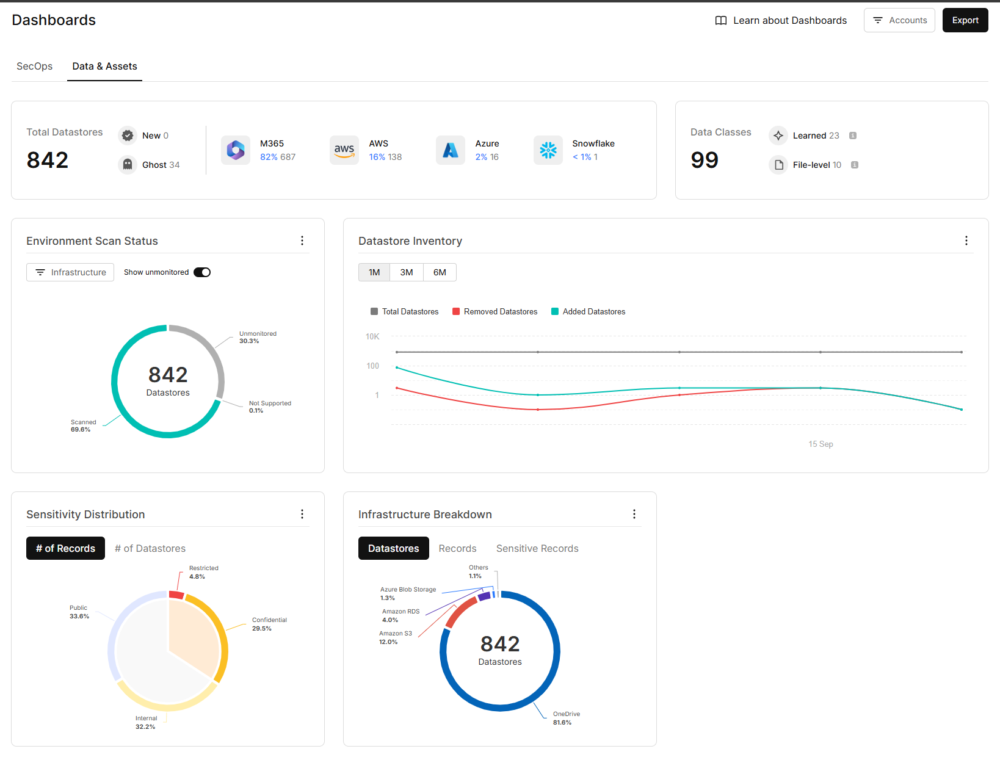

### Cyera

### Rating: 2.33

#### Overview
* Deployment was complete with all the required data sources except Databricks.
* Data classification is very limited but accurate for classifed data. Many columns were left without classification like city name, driver license, date, last 8 digits of SSN and many more columns.
* Very expensive! Ahead request to force stop the discovery of remaining data after two days as cost burn down was quite high for the first 50 TB data.
* Good integration with Office 365.
* No support for databricks.
* $\textcolor{red}{\text{Uses most privilage mode (Administrator account is created when Cyera stack was deployed into Azure).}}$
* $\textcolor{red}{{\text{Data is transmitted to Cyera's cloud for sampling and analysis, indicating that Cyera retains the data within their environment.}}}$
* $\textcolor{red}{\text{No posture management with current version. Will be available in next releases of Cyera platform.}}$
* $\textcolor{red}{\text{No audit trails in current version. One of the use case of role assumption was not demonstrated as the feature was not available in current version of Cyera.}}$
* $\textcolor{red}{\text{Cyera Team did not agreed to perform delta scan as they mentioned that, "We need to take permission from their higher authorities for doing this in POC"}}$
* $\textcolor{orange}{\text{Control over cluster scaling in and out is not possible as it's managed by DevOps team of Cyera (Backoffice channels). Uses Karpernter or similar technologies for K8s scaling.}}$
* $\textcolor{orange}{\text{Cyera deployment uses spot instances for data discovery. This is not recommended for production deployment.}}$
* $\textcolor{orange}{\text{Business executives were overpowering the technical team and reviewers to perform limited tests in POC. (Proof: Please review all the meeting recordings for verification and conclusion on this observation.)}}$

#### Key Features
| Cyera Feature             | Availability  | Description | $\textcolor{Red}{\text{Notes [For Ahead Only]}}$ |
|-------------------        |--- |-------------|---|
| Data Discovery            | ✓ | Automatically identifies and catalogs sensitive data across various data sources | - Cyera was able to discover all the data stores in AWS, Azure, Snowflake and Office 365.    - Databricks is not supported by Cyera. |
| Data Classification       | ❕ | Data classification is based on sampling hence the classified data were quite accurate but very limited. | - Cyera's data calssification is accurate, only for limited data.    - Across all the classified data, simple columns like Driver license, city, URL or web address, ZIP code, and many other were not classified!    - [Please refer the screenshots for more details. Click me.](../assets/cyera/data-classification) |
| Risk Assessment           | ❕ | Evaluates data security risks and provides limited actionable insights and no data coverage tracability | - Cyera's platform provides very basic risk assessment reports like plain text or Publicly shared sensitive Microsoft 365 files.    - Cyera's platform does not provide any data coverage traceability. |
| Access Control            | ❕ | Data access permissions monitoring was not robust and not reliable | - All the different types of accounts were identified and platform lacks the detailed information about the permissions.    - Cyera mentioned that their scan is not complete and cannot provide more details! |
| Compliance Monitoring     | ✓ | Ensures adherence to regulatory requirements and industry standards | - Custom rules can also be added as a self-service feature. |
| Threat Detection          | ❌ | Potential security threats and anomalies detection rate is not accurate and less reliable | - No delata scans were made during POC.    - Cyera team did not demonstrate this feature in detail. |
| Data Encryption           | ❕ | Cyera team did not provide insights on how sampling data is transmitted to Cyera cloud for classification | |
| Activity Monitoring       | ❕ | - Tracks and logs user activities related to sensitive data in Office 365 only. | Robust tracking and logs user activities related to sensitive data in Office 365    - Except Office 365, no other data scources were monitored in POC. |
| Incident Response         | ❌ | Cyera team did not demonstrate this feature and mentioned that this feature is available in future releases of their product | |
| Integration Capabilities  | ✓ | Connects with Wiz and cloud platforms | |
| Reporting and Analytics   | ✓ | Generates high level reports and provides data visualization along with data samples for verification | |
| Automated Remediation     | ❌ | Does not or atleast this feature was not demonstrated, which offers automated solutions for addressing identified security issues.   Note: Scan was incomplete due to force stop as cost burn down was high for the first 50 TB data. | |
|||||

#### <u>Strengths & Weaknesses</u>

**Strengths:**
* **Data Classification**: Accurate but limited data classification based on sampling.
* **Office 365 Integration:** Demonstrated good integration capabilities with Office 365, which is important for Capital Group.
* **Compliance Monitoring**: Effective compliance monitoring with a feature to add custom policies.
* **Dashboards and Reports**: Good reporting and analytics with data visualization.

**Weaknesses:**
* **Costly**: Very expensive, resulted in force stopping the data scan after 50 TB.
* **Datawarehouse**: No support for Databricks.
* **Posture Management**: Lack of posture management in the current version.
* **Risk Assessment**: Limited risk assessment with no data coverage traceability.
* **Access Control**:Unreliable access control and permissions monitoring.
* **Data Encryption**:Lack of transparency in data encryption for sampling and analysis of the classification process.
* **Automated Remediation**: No automated remediation capabilities demonstrated but integration is possible with Wiz, Jira and Webhooks.

#### Integration Checklist

| Resource | Integration Status | Notes |
|----------|------------|-------|
| AWS      | Yes | - S3 Buckets   - RDS for Oracle, Postgres, SQL Server  |
| Azure    | Yes | - Azure AD integration   - Azure Blob storage access   - ADLS Gen 2   - Azure Database for Oracle, Postgres, SQL Server   - Audit Logs were not enabled or integrated |
| Snowflake| Yes | - Set up Snowflake account integration - Configure access to relevant databases and schemas - Verify query history and access logging |
| Databricks| No |  |
| Office 365| Yes | - Set up Microsoft Graph API integration - Configure access to relevant services (SharePoint, OneDrive, etc.) - Enable audit logging for Office 365 activities |
||||

 

**Data Discovery Coverage:**

| Data Source | Discovery Coverage |
|---|---|
| AWS | 30% |
| Azure | 50% |
| Snowflake | 100% |
| Databricks | 0% |
| Office 365 | 100% |
| SQL Server on EC2 | 0% |
| **Total** | **56%** |
|||

#### Chart View

HTML Chart URL: [Cyera Data Discovery](https://dccpl.work/cgah-dspm-ve/vendor-b/vendor-b-data-coverage-chart.html)

Screenhsot from Cyera Dashboard on Review Day:

***

#### Cyera Data Discovery and Classification:

$\textcolor{red}{\text{Important Observation [For Ahead Only]:}}$
* Data discovery and classification results are not up to the mark. Logically and factually, the record count of CC Number, Phone number should be same. The data source contains one to one relationship between these two fields.
* Hence, evaluating further features not required as Cyera's data authenticity is not reliable.

***

 

**Cost Analysis:**

| Day                               | Cost (USD) |
|---|---|
| Day 1 - Tuesday, 10-Spet-2024     | $ 281.03        | $ 24.44           |
| Day 2 - Wednesday, 11-Spet-2024   | $ 8464.45       | $ 189.06          |
| Day 3 - Thursday, 12-Spet-2024    | $ 4704.03       | $ 85.28           |
| Day 4 - Friday, 13-Spet-2024      | $ 598.74        | $ 60.35           |
| Day 5 - Saturday, 14-Spet-2024    | $ 526.60        | $ 60.43           |
| Day 6 - Sunday, 15-Spet-2024      | $ 400.97        | $ 59.00           |
| Day 7 - Monday, 16-Spet-2024      | $ 361.35        | $ 19.73           |
| **Total**                         | **$ 15337.17**  | **$ 498.29**      |
|||

#### Cyera Cost Analysis:

 

HTML Chart URL: [Cyera Cost Burn Down and Peak Cost charts](https://dccpl.work/cgah-dspm-ve/vendor-b/vendor-b-cost-burndown-chart.html)

#### Evaluation Summary
Cyera demonstrates okayish capabilities in data discovery and classification across multiple cloud platforms, including AWS, Azure, Snowflake, and Office 365. However, the evaluation reveals several significant limitations:

1. Incomplete data discovery (56% total coverage) due to cost concerns and forced stoppage.
2. Lack of posture management features in the current version.
3. Limited risk assessment capabilities without data coverage traceability.
4. Unreliable access control and permissions monitoring.
5. Inaccurate and unreliable threat detection.
6. Lack of transparency in data encryption for the classification process.
7. Absence of incident response features.
8. No automated remediation capabilities, although integration is possible with third-party tools.

While Cyera shows promise in its integration capabilities with major cloud providers and services, the platform falls short in critical areas of data security posture management. The incomplete data discovery and lack of essential features like posture management, reliable risk assessment, and incident response significantly impact its overall effectiveness. 

Further development and improvements in these areas would be necessary for Cyera to provide a more comprehensive and reliable DSPM offering.

***

#### Rederences
1. Review meeting URL: Not available as meeting was not recorded due incomplete scan.

2. Excel file containing Cyera response for FR and NFRs: [Download Exxcel File](../assets/cyera/reports/Cyera_Response_Master_DSPM_Vendor_Eval_N-FRs.xlsx)

3. Final Report by Cyera: [Download PDF File](../assets/cyera/reports/Cyera%20Ahead%20CapGroup%20PoV%20findings.pdf)
***