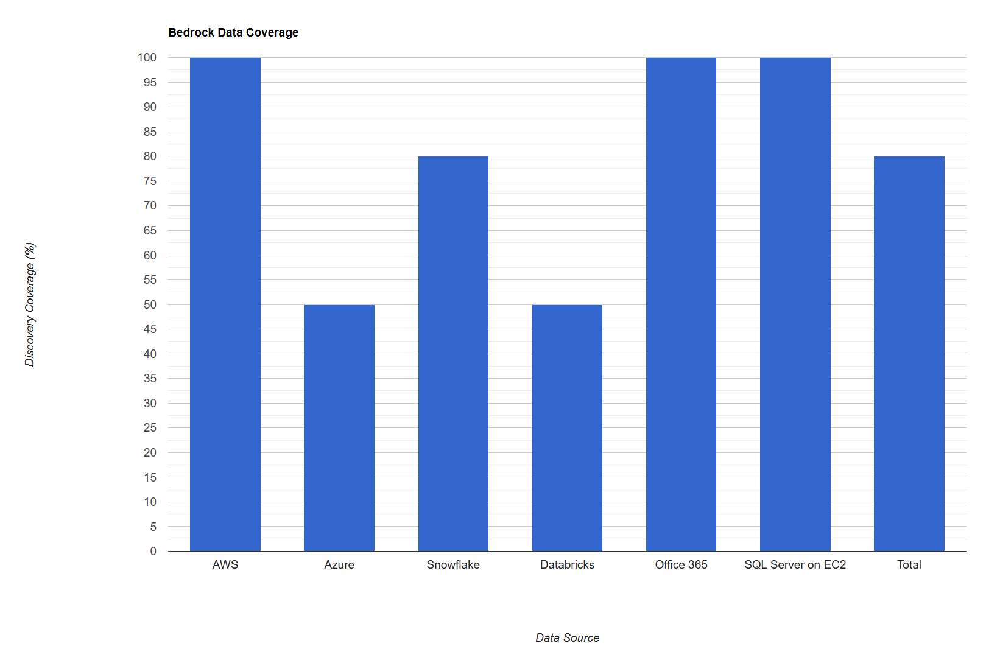
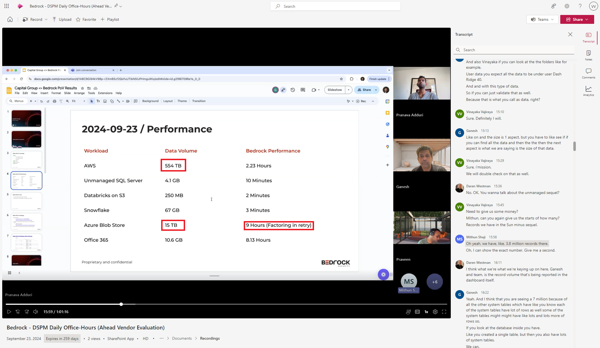
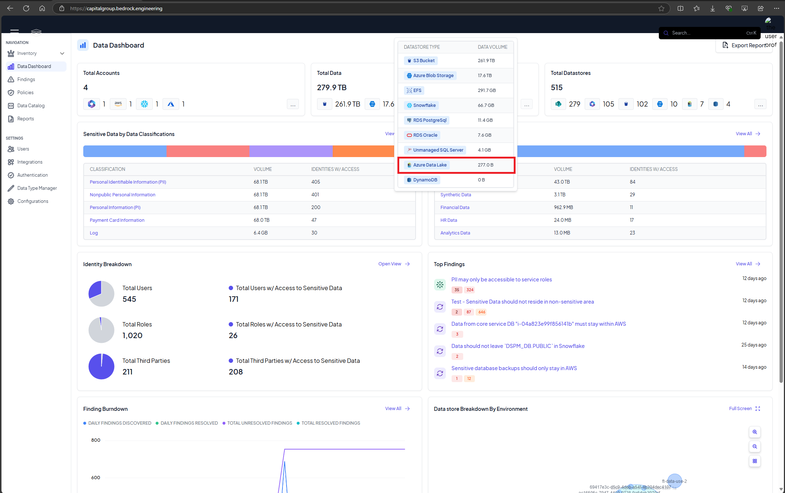
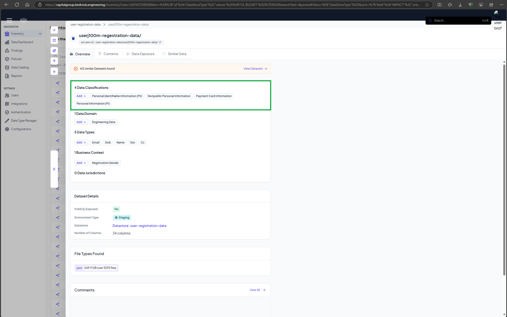
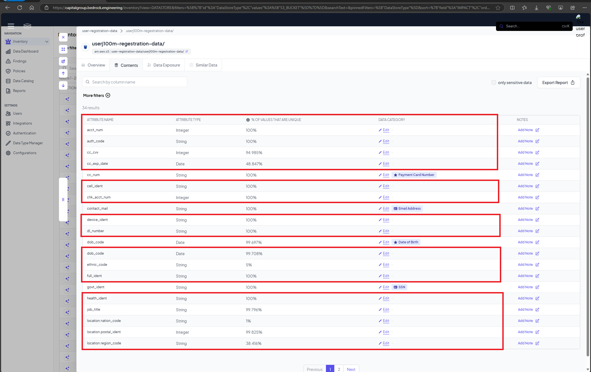
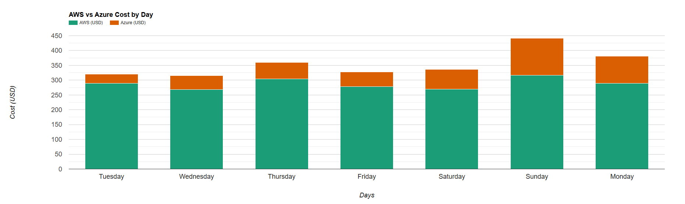
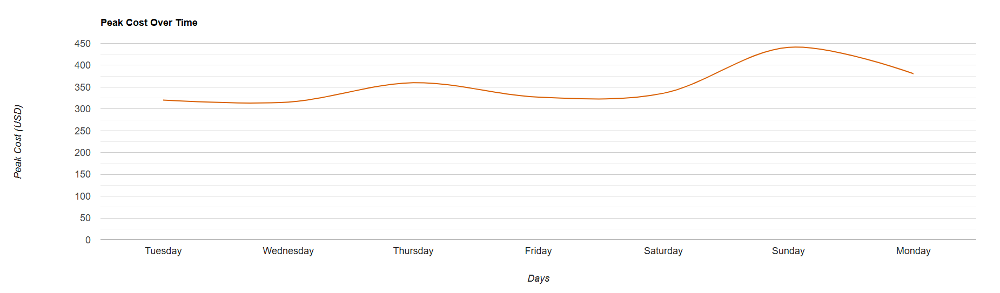

### Bedrock

### Rating: 3.89

#### Overview
* Deployment was complete with all the required data sources.
* Data classification is quite accurate with discovered data.
* $\textcolor{red}{\text{Challenges in Azure ADLS Gen 2 and blob storage. Data discovery was not accurate as volume was off by 3 TB against actual volume on the review day.}}$
* $\textcolor{red}{\text{Bedrock doesnot use standard or appropriate scanning methods for Databricks, instead scans the source (ADLS Gen 2 if Databricks is deployedi n Azure and AWS S3 buckets if Databrocks is deployedin AWS) resulting in invalid results as the gold data or aggregated data is not considered for the scans.)}}$
* $\textcolor{orange}{\text{User experience is not intuative and KPIs are not usefull (Ex: Sharepoint KPI has a value of 226.k and M365 has the value of 3.0 M, which does not make sense while interpreting as files or list rows or what is the category)}}$
* $\textcolor{orange}{\text{Bedrock was not able to scan the data from Azure Data Blob storage (containers), sighting a bug in the product.}}$
* $\textcolor{orange}{\text{Bedrock's dashboard and UI is good at top level view. Drill-down information is very limited, making the bad user-experience leaving without contextual information..}}$
* $\textcolor{green}{\text{Least expensive and very fast data discovery and catalogging in comparision of all the 4 vendors. (Due to fingerprinting and hashing technology against reading all the data from each data stores). This can lead to incomplete data discovery, as it might miss hidden or nuanced data patterns (e.g., irregular data distributions, outliers, or infrequent data types).}}$

#### Key Features
| Bedrock Feature | Availability | Description | $\textcolor{Red}{\text{Notes [For Ahead Only]}}$ |
|-------------------|---|-------------|---|
| Data Discovery    | ❕ | Automatically identifies and catalogs sensitive data across various data sources | - Data in ADLS Gen 2 was not discovered and improper scans with Azure Blob Storage    - Data in Databricks was discovered in raw format/source, not aggregated. |
| Data Classification | ✓ | Data classification is based on sampling hence the classified data were quite accurate. | - Bedrock's high level classification is accurate (at the file level) but not at the column or key-values or headers. (Refer the screenshots for more details)    - Similar datasets are grouped together only from the same bucket but not across all the CSP resources. |
| Risk Assessment   | ❕ | Evaluates data security risks and provides limited actionable insights and provides very limited data tracability using cloud trail logs.| - Very limited risk assesment information available on the dashboard.    - Limited data traceability using cloud trail logs. |
| Access Control    | ❕ | Data access permissions monitoring was not robust and less reliable | - 'Activity Access' tab in the plarform provides very less information hinting the issue in access control but measures cannot be taken within the  dashboard like other DSPM vendor platform. |
| Compliance Monitoring | ❌ | Ensures adherence to regulatory requirements and industry standards but no custom control for choosing specific regulatory requirements.| - Apart from custom compliance definitations, global coverage is not present in the platform (Ex: US standard data protection, HIPAA, GDPR, etc.) |
| Threat Detection  | ✓ | Potential security threats and anomalies detection rate is Limited as exposure and access control explaination or details on UI is very limited | - Bedrock can tag the IP data and monitor it's access and activity.    - Bedrock platform provides list of effected entities under detection rules. |
| Data Encryption   | ❕ | Bedrock team mentioned that metadata is sent to Bedrock cloud for classification |  |
| Activity Monitoring | ✓ | Tracks and logs user activities related to sensitive data using cloud trail logs. |  |
| Incident Response | ❕ | Bedrock team captures incident reposnse for data at rest and not in motion. |  |
| Integration Capabilities | ❌ | Limited integration capabilities with existing security tools and cloud platforms |  |
| Reporting and Analytics | ! | Generates high level reports and provides data visualization. Not an intuative UI as there is not drill-down reports or visualizations | - Bedrock's UI and UX is not good as the contextual information provided/available on the platform is very limited, leaving users to navigate out of the platform to find relevant information by manual inspection or with other CSPM or DLP tools. |
| Automated Remediation | ❕ | Provides limited remediation capabilities but not automated solutions for addressing identified security issues. | - Bedrock provides the list of effected entities but not the remediation steps. |

#### <u>Strengths & Weaknesses</u>

**Strengths:**
1. Accurate data classification at the top level, based on sampling techniques.
2. Complete deployment with most required data sources.
4. Effective threat detection capabilities.
5. Strong activity monitoring capabilities using Cloudtrail logs.
6. Quick scanning and data discovery.
7. Least expensive, with very low cost burn down for initial data discovery.

**Weaknesses:**
1. Not reliable integration with Azure ADLS Gen 2, blob container and Databricks on Azure.
2. Posture management in very limited.
3. Limited risk assessment with limited data coverage traceability.
4. Limited incident response features.
5. No automated remediation capabilities demonstrated but integration is possible with Jira and Webhooks.

#### [Review Required] Integration Checklist

| Resource | Integration Status | Notes |
|----------|------------|-------|
| AWS      | Yes | - S3 Buckets   - RDS for Oracle, Postgres, SQL Server  |
| Azure    | Limited | - Azure AD integration   - Azure Blob storage access   - Limited integration with ADLS Gen 2   - Azure Database for Oracle, Postgres, SQL Server |
| Snowflake| Yes | - Set up Snowflake account integration  - Hive meta store  - Verify query history and access logging |
| Databricks| Limtied | - Databricks integration in AWS is complete.   - Databricks integration in Azure is limited. |
| Office 365| Yes | - Set up Microsoft Graph API integration   - Configure access to relevant services (SharePoint, OneDrive, etc.). |

 

**Data Discovery Coverage:**

| Data Source | Discovery Coverage |
|---|---|
| AWS | 100% |
| Azure | 50% |
| Snowflake | 80% |
| Databricks | 50% |
| Office 365 | 100% |
| SQL Server on EC2 | 100% |
| **Total** | **80%** |
|||

### Chart View

HTML Chart URL: [Bedrock Data Discovery](https://dccpl.work/cgah-dspm-ve/vendor-c/vendor-c-data-coverage-chart.html)

 

Screenshot from Bedrock Dashboard on Review Day:

* Reported AWS data volume is 554 TB which is double the actual volume in AWS data stores.
* Azure Blobl Storege is off by 3+ TB. Actual volue is 17.6 TB.

***

### Bedrock Data Discovery and Classification:
Bedrock Dashboard:

 
 
S3 Bucket - High Level Classification:

S3 Bucket - File Level Classification

* Lacks in-detail classification for field values.

***

**Cost Analysis:**

| Element | AWS Cost (USD) | Azure Cost (USD) |
|---|---|---|
| Day 1 - Tuesday   | $   289.59      | $   30.69       |
| Day 2 - Wednesday | $   268.57      | $   47.03       |
| Day 3 - Thursday  | $   304.10      | $   55.87       |
| Day 4 - Friday    | $   278.71      | $   48.29       |
| Day 5 - Saturday  | $   269.23      | $   66.57       |
| Day 6 - Sunday    | $   315.93      | $   125.22       |
| Day 7 - Monday    | $   289.74      | $   91.03       |
| **Total**         | **$ 2015.87**   | **$ 464.70**     |
|||

#### Bedrock Cost Analysis:

 

HTML Chart URL: [Bedrock Cost Burn Down and Peak Cost charts](https://dccpl.work/cgah-dspm-ve/vendor-c/vendor-c-cost-burndown-chart.html)

***

#### Evaluation Summary

Bedrock demonstrates strong capabilities in data discovery and classification across multiple cloud platforms, including AWS, Azure, Snowflake, Databricks and Office 365. The evaluation reveals a few significant limitations:

1. Limited posture management features.
2. Inaccurate data discovery (50% coverage) for Azure ADLS Gen 2 and blob container.
3. Limited risk assessment capabilities without complete data coverage traceability.
4. Unreliable access control and permissions monitoring.
5. Limited threat detection.
6. Lack of transparency in data encryption for the classification process.
7. Limited incident response features.
8. Limited automated remediation capabilities, although integration is possible with third-party tools.

While Bedrock shows promise in its integration capabilities with major cloud providers and services, the platform falls short in critical areas of data security posture management. The inaccurate data discovery and lack of essential features like posture management, reliable risk assessment, and incident response significantly impact its overall effectiveness. 

***
***