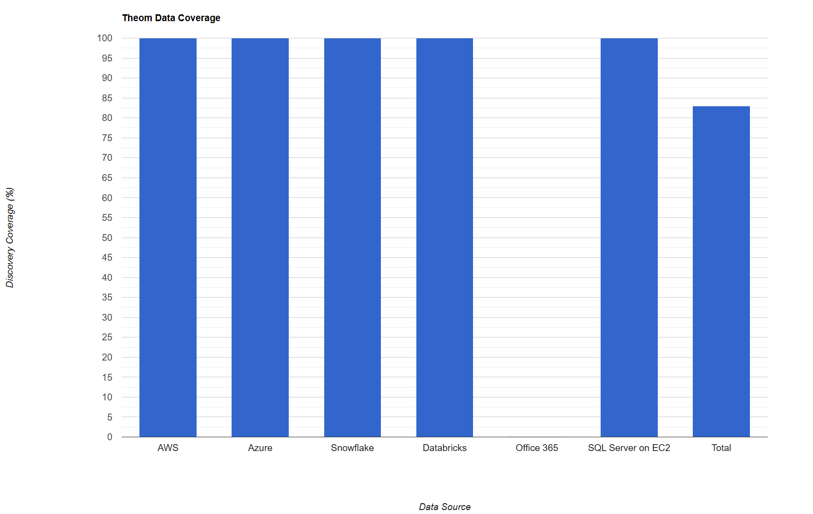

### Theom

### Rating: 4.11

#### Overview
* Deployment was complete with all the required data sources except office 365.
* Data classification is accurate with discovered data.
* Custom data calssification is possible with training and test data for Theom ML models.
* $\textcolor{red}{\text{Databricks integration is not yet supported yet. Theom mentioned that Databricks integration will be coming with in next two quarters (Q4-2024 or Q1-2025).}}$
* $\textcolor{orange}{\text{Medium learning curve to adopt UI usage. Once the UI features are known, platform covers wide range of details starting from data discovery, classification to MITRE (risk assesment).}}$
* $\textcolor{green}{\text{Less expensive and very fast data discovery and catalogging in comparision against Varonis and Cyera.}}$

#### Key Features
| Theom Feature | Availability | Description | $\textcolor{Red}{\text{Notes [For Ahead Only]}}$ |
|-------------------|---|-------------|---|
| Data Discovery    | ✓ | Automatically identifies and catalogs sensitive data across various data sources | - Data discovery was comprehensive, with the exception of Databricks, as there is no available integration for this platform. |
| Data Classification | ✓ | Data classification is based on sampling hence the classified data were quite accurate. | - Good data classification with exception of few columns. |
| Risk Assessment   | ✓ | MITRE dashboard is a very effective and this feature is the best of 4 vendors.|  |
| Access Control    | ✓ |  |
| Compliance Monitoring | ✓ | Ensures adherence to regulatory requirements and industry standards.| - Theom provides robust compliance monitoring with custom security rules. |
| Threat Detection  | ✓ | Potential security threats and anomalies detection rate is quite accurate and provides detailed explanation on UI. May need help from Theom for understanding the data on UI and deploy custom controls.| - Data access permissions monitoring was robust and reliable. | - Good details are available under 'Audit Logs' in Theom platform. |
| Data Encryption   | ✓ | Theom team mentioned that no data is sent to Theom cloud for any purpose like classification, custom modeling, etc,. |  |
| Activity Monitoring | ✓ | Tracks and logs user activities related to sensitive data using cloud trail logs. | - Good details are available under 'Audit Logs' in Theom platform. |
| Incident Response | ❕ | Theom platform captures incident reposnse for data at rest and not in motion. | - Robust incident reporting features for data at rest only. |
| Integration Capabilities | ✓ | Theom integrates with Wiz, Jira and other popular cloud platforms. Custom integration is also possible (on-demand feature) |  |
| Reporting and Analytics | ! | Generates high level reports and provides data visualization. Theom team also emphasises that API are available and contains more information than displayed in their UI. Integration with Data catalog tools is also possible for context co-relation. | - Theom team mentioned that lot of contextual data is available in APIs and allows integration with data cataloge tools. |
| Automated Remediation | ❕ | Provides limited remediation capabilities but not automated solutions for addressing identified security issues. |  |

#### <u>Strengths & Weaknesses</u>

**Strengths:**
1. Accurate data classification, which is based on sampling.
2. Complete deployment with most required data sources except Office 365.
3. MITRE dashboard is very effective and usefull. 
4. Effective compliance monitoring.
5. Strong activity monitoring capabilities.
6. Quick scanning and data discovery.
7. Least expensive, with very low cost burn down for initial data discovery
8. Integration with data catalog systems.

**Weaknesses:**
1. No integration with Office 365.
2. API contains more useful data which is not covered in UI.

#### [Review Required] Integration Checklist

| Resource | Integration Status | Notes |
|----------|------------|-------|
| AWS      | Yes | - S3 Buckets   - RDS for Oracle, Postgres, SQL Server  |
| Azure    | Yes | - Azure AD integration   - Azure Blob storage access   - ADLS Gen 2   - Azure Database for Oracle, Postgres, SQL Server   - Audit Logs were not enabled or integrated |
| Snowflake| Yes | - Set up Snowflake account integration - Hive meta store - Verify query history and access logging |
| Databricks| Yes | Databricks integration is complete |
| Office 365| No | - Integration feature coming in near feature release |

 

**Data Discovery Coverage:**

| Data Source | Discovery Coverage |
|---|---|
| AWS | 100% |
| Azure | 100% |
| Snowflake | 100% |
| Databricks | 100% |
| Office 365 | 0% |
| SQL Server on EC2 | 100% |
| **Total** | **83%** |
|||

### Chart View

HTML Chart URL: [Bedrock Data Discovery](https://dccpl.work/cgah-dspm-ve/vendor-d/vendor-d-data-coverage-chart.html)

 

**[WIP] Cost Analysis:**

| Element | AWS Cost (USD) | Azure Cost (USD)|
|---|---|---|
| Day 1 - Tuesday   | $   356.31      | $   71.92       |
| Day 2 - Wednesday | $   449.62      | $   49.98       |
| Day 3 - Thursday  | $   377.97      | $   36.67       |
| Day 4 - Friday    | $   374.17      | $   39.90       |
| Day 5 - Saturday  | $   364.11      | $   52.33       |
| Day 6 - Sunday    | $   360.66      | $   50.48       |
| Day 7 - Monday    | $   366.60      | $   45.40       |
| **Total**         | **$ 2649.44**   | **$ 346.68**     |
|||

#### Evaluation Summary

Theom demonstrates strong capabilities in data discovery and classification across multiple cloud platforms, including AWS, Azure, Snowflake, Databricks and doesn't integrate with Office 365. The evaluation reveals a few significant limitations:

1. No integration with Office 365.
2. API contains more useful data which is not covered in UI.

While Theom shows promise in its integration capabilities with major cloud providers and services, the platform falls short in critical areas of data security posture management. The lack of essential features like Office 365 integration significantly impact its overall effectiveness. 